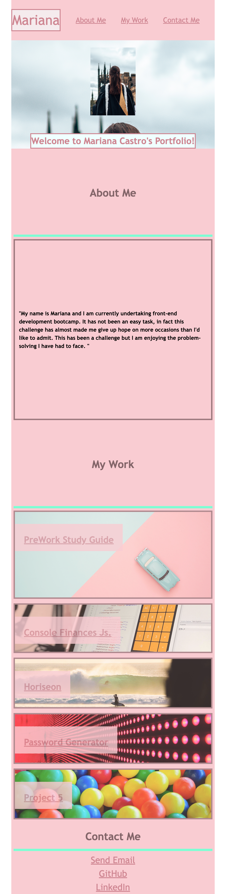

# personal-portofolio

## Description
This is personal portfolio that showcases my recent projects as a Front-End Web Developer. It highlights deployed web applications, my contact details as well as a small image of myself for familiarity. 

This webpage not only showcases deployed applications created through refactoring, javascript skills but is heavily built on my CSS skills. 

The colour scheme is built upon the main avatar image as well as the main project image. 

## Full Page Screenshot

### Smallest Screen-size Screenshot

## Link
You can find the webpage [here](https://marianapcs.github.io/personal-portofolio/)
